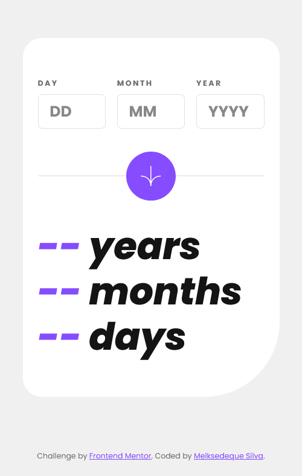
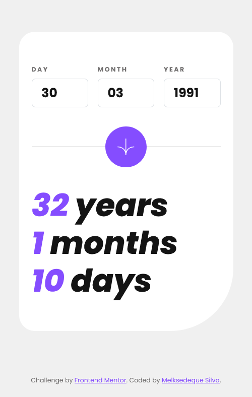
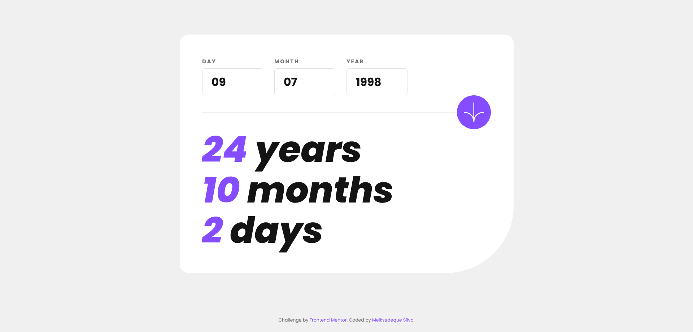

# Frontend Mentor - Age calculator app solution

This is a solution to the [Age calculator app challenge on Frontend Mentor](https://www.frontendmentor.io/challenges/age-calculator-app-dF9DFFpj-Q). Frontend Mentor challenges help you improve your coding skills by building realistic projects. 

## Table of contents

- [Overview](#overview)
  - [The challenge](#the-challenge)
  - [Screenshot](#screenshot)
  - [Links](#links)
- [My process](#my-process)
  - [Built with](#built-with)
  - [What I learned](#what-i-learned)
  - [Continued development](#continued-development)
  - [Useful resources](#useful-resources)
- [Author](#author)

## Overview

This is an old calculator. Based on the date entered by the user, it returns the number of years, months and days from the entered date to the current day.

This calculator performs several validations before doing the math.

First it validates if the fields are blank.

Second, it uses REGEX to allow only numbers to be entered into fields. Since we are performing date calculations, we don't need to enter letters or other characters.

Third, it performs the limitation of 2 digits for Days and Months, and 4 digits for Year;

Fourth, with the fields typed in, it validates the data entered.
- If the day is greater than 31, the month is greater than 12 or the year is greater than the current year;
- If the 31st is inserted in a month that has only 30. Or 28, like February;
- If the year is a leap year, it validates that the month of February can have 29 days;

Fifth, it performs the complete age calculation based on the date entered by the user and the current date;

### The challenge

Users should be able to:

- View an age in years, months, and days after submitting a valid date through the form
- Receive validation errors if:
  - Any field is empty when the form is submitted
  - The day number is not between 1-31
  - The month number is not between 1-12
  - The year is in the future
  - The date is invalid e.g. 31/04/1991 (there are 30 days in April)
- View the optimal layout for the interface depending on their device's screen size
- See hover and focus states for all interactive elements on the page
- **Bonus**: See the age numbers animate to their final number when the form is submitted

### Screenshot






### Links

- Live Site URL: [Deploy](https://melksedeque.github.io/age-calculator-app/)

## My process

### Built with

- Semantic HTML5 markup
- CSS custom properties
- SASS
- JavaScript
- [Flexbox](https://css-tricks.com/snippets/css/a-guide-to-flexbox/) - Flexbox
- Mobile-first workflow
- Bootstrap
- [Bootstrap](https://getbootstrap.com/) - Bootstrap 5.2.3

### What I learned

I'm particularly proud of the two blocks of code below.

In the first, I learned how to fetch the last day of the chosen one based on the month and year typed by the user. In this way, to perform date validations, I was able to prevent the insertion of the 31st in months that have only 30 days and prevent the insertion of the 29th and 30th in February that have only 28 days. As this function also uses the year to bring the number of days of the chosen month, I was able to also prevent leap years like 2000, 2004, 2008... so, if any of these years are inserted in the form, it allows the insertion of the day 29 in February.

```JS
const day = parseInt(inputDay.value, 10);
const month = parseInt(inputMonth.value, 10);
const year = parseInt(inputYear.value, 10);

function isValidDate(day, month, year) {
  const daysInCurrentMonth = daysInMonth(month, year);
  return day <= daysInCurrentMonth;
}
  
function daysInMonth(month, year) {
  return new Date(year, month, 0).getDate();
}
```

The second block gave me a little more headache to solve. I had to do a lot of research on how to calculate the difference between the date entered by the form and the current day.

I learned that for a more accurate calculation of time I needed to convert everything to milliseconds, so I was able to calculate the difference between dates. I also learned that to calculate the full months and days after subtracting the years between dates I would need to use MOD to calculate, which was initially not part of the plan, I thought it would be a simple subtraction calculation.

```JS
const userDay = inputDay.value;
const userMonth = inputMonth.value;
const userYear = inputYear.value;
const userFullDate = new Date(userYear, userMonth - 1, userDay);

const yearInMs = 1000 * 60 * 60 * 24 * 365;
const monthInMs = 1000 * 60 * 60 * 24 * 30;
const dayInMs = 1000 * 60 * 60 * 24;

let diffInMs = date.getTime() - userFullDate.getTime();

const years = Math.floor(diffInMs / yearInMs);
const months = Math.floor((diffInMs % yearInMs) / monthInMs);
const days = Math.floor(((diffInMs % yearInMs) % monthInMs) / dayInMs);
```

### Continued development

After completing my current project, I intend to invest more time in improving my skills in API and AJAX. I believe these skills are essential for developing more dynamic and interactive web applications. Additionally, I plan to use these skills to start developing with React, one of the most popular and powerful libraries for user interface development. I believe that combining these skills will allow me to build more sophisticated and high-performance web applications that can meet the needs of the market and users.

### Useful resources

- [Math.floor()](https://www.w3schools.com/jsref/jsref_floor.asp) - This function helped calculate the number of whole months remaining after subtracting all whole years from the difference between two dates, rounding the result down to an INT number.
- [Date()](https://www.w3schools.com/js/js_date_methods.asp) - The Date() used in the function daysInMonth() function, returns the last day of the month of the year specified by the input arguments.

## Author

- Website - [Melksedeque Silva](https://github.com/Melksedeque/)
- Frontend Mentor - [@Melksedeque](https://www.frontendmentor.io/profile/Melksedeque)
- Twitter - [@SouzaMelk](https://twitter.com/SouzaMelk)